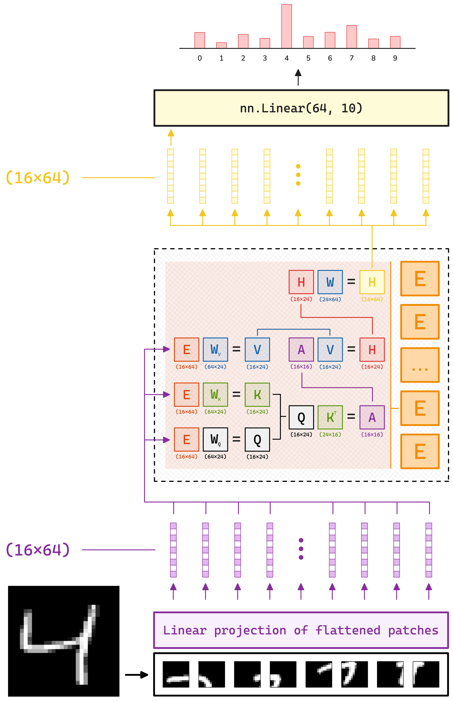
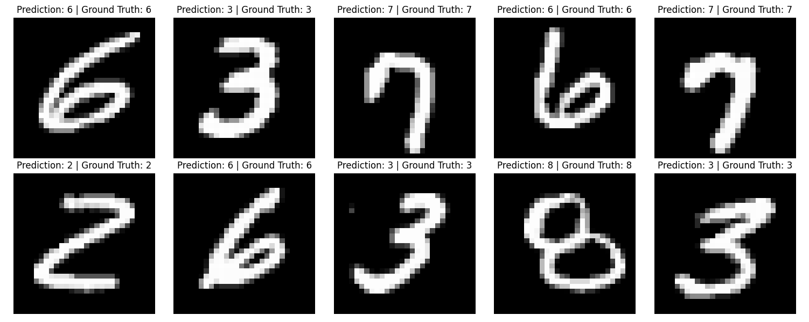
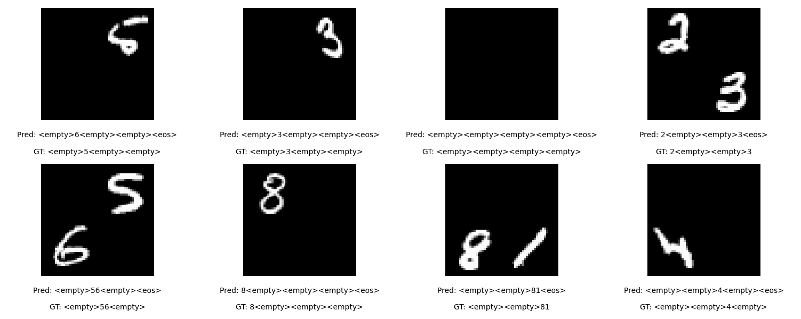

# Multi-Digit Image Classification with Vision Transformer

In this week's project, we will build a multidigit Transformer model which generates prediction on an image containing multiple (unknown number) of digits from the MNIST dataset.

The task is to build a tool that:

    - takes an image with multiple digits (combination of MNIST digits in a single image - might include empty spaces);
    - applies the created Transformer architecture;
    - predicts the sequence or set of digits.

I have divided the progress in three steps:

1. Read the 'Attention Is All You Need' paper and understand each individual component of the Transformer.
2. Build an encoder to solve the classification problem for predicting a single digit from an image using just an encoder.

   ### Visual Diagram of the task:

   

   ### Prediction results:

   

3. Build an encoder-decoder Transformer to solve the problem for an n < 4 number of digits in a 2x2 square scattered (randomly) around a canvas.

   ### Results:

   
